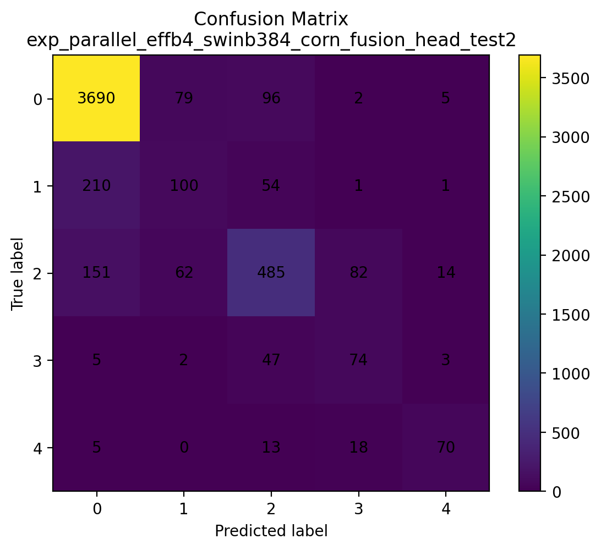

# Diabetic Retinopathy Grading

Deep learning-based diabetic retinopathy (DR) screening prediction using regular fundus images from DeepDRiD v1.1.

This project trains, evaluates, and runs single-image inference with a dual-backbone ordinal model:

- EfficientNet-B4
- Swin Transformer Base 384
- Feature fusion head
- CORN ordinal classification

This is a research and education project. Model outputs are screening predictions and are not a substitute for professional medical evaluation.

---

## DR Grades

| Class | Label |
|:---:|---|
| 0 | No DR |
| 1 | Mild |
| 2 | Moderate |
| 3 | Severe |
| 4 | Proliferative DR |

The classes are ordered by disease severity, so the project treats grading as an ordinal classification problem rather than a standard five-class softmax task.

---

## Model

The implemented model is:

```text
Fundus image
    |
    +--> EfficientNet-B4 feature extractor
    |
    +--> Swin Transformer Base 384 feature extractor
              |
              v
       feature concatenation
              |
              v
          fusion head
              |
              v
       4 CORN ordinal logits
              |
              v
       predicted DR grade 0-4
```

For five DR classes, CORN produces four ordinal logits. The evaluation and prediction code convert those logits into a final grade using `coral_pytorch.dataset.corn_label_from_logits`.

The model architecture is defined in `Train.py`, mirrored in `Test.py`, and reproduced in `predict.py` for standalone inference. The trained architecture and checkpoint are not changed by the inference script.

---

## Dataset

This implementation uses the official DeepDRiD v1.1 regular fundus dataset.

Data used in this project:

- 1,200 official DeepDRiD training images for model development
- 400 official DeepDRiD validation images for final held-out evaluation
- Ultra-widefield images were not used
- Online challenge images were not used

Local labels are stored as:

```text
dataset/deepdrid_train_labels.csv
dataset/deepdrid_validation_labels.csv
```

Both CSV files use:

```text
image,level
```

### Class Distribution

Training set:

| Class | Images |
|:---:|---:|
| 0 | 540 |
| 1 | 140 |
| 2 | 234 |
| 3 | 214 |
| 4 | 72 |
| Total | 1,200 |

Held-out evaluation set:

| Class | Images |
|:---:|---:|
| 0 | 174 |
| 1 | 46 |
| 2 | 92 |
| 3 | 68 |
| 4 | 20 |
| Total | 400 |

The dataset and processed image folders are local artifacts and are intentionally excluded from Git.

---

## Preprocessing

`Preprocessing.py` prepares fundus images before training and evaluation.

The preprocessing pipeline includes:

- Retinal field-of-view handling with automatic fundus cropping
- Square padding to reduce shape distortion
- Resizing to 384 x 384
- CLAHE enhancement in LAB color space
- JPEG output

`Test.py` uses deterministic evaluation preprocessing:

- Load image as RGB
- Resize to 384 x 384
- Convert to tensor
- Normalize with ImageNet mean/std

`predict.py` reuses the existing `Preprocessing.py` pipeline for raw fundus images by default, then applies the same deterministic tensor transform used by `Test.py`. If an image has already been processed by `Preprocessing.py`, pass `--input-preprocessed`.

Training-time augmentations are not applied during evaluation or single-image prediction.

---

## Training

The training implementation uses:

- AdamW optimizer
- Learning rate `3e-5`
- Weight decay `1e-4`
- Up to 20 epochs
- Cosine annealing scheduler
- CUDA automatic mixed precision
- Gradient checkpointing
- Horizontal flip
- Color jitter
- Random affine transforms
- MixUp
- Label smoothing
- Random erasing

Current saved epoch-15 run metadata reports:

| Setting | Value |
|---|---:|
| Image size | 384 x 384 |
| Number of classes | 5 |
| Batch size | 2 |
| Epochs | 20 |
| Fusion hidden dimension | 1024 |
| Fusion dropout | 0.3 |

Before retraining, check the `Config` section in `Train.py` because these values are configurable.

---

## Best Checkpoint

The best saved checkpoint is from epoch 15:

```text
outputs/exp_parallel_effb4_swinb384_corn_fusion_head/models/model_epoch_015_qwk_0.8943.pth
```

Internal training-time validation result:

```text
QWK = 0.8943
```

This internal validation QWK is not the final held-out evaluation result. The final evaluation below was measured separately on the 400 official DeepDRiD validation images.

---

## Final Held-Out Evaluation

The trained model was evaluated on the 400-image held-out DeepDRiD validation set.

| Metric | Result |
|---|---:|
| Accuracy | 71.75% |
| QWK | 0.7813 |
| Micro F1 | 0.7175 |
| Weighted F1 | 0.7131 |
| Macro F1 | 0.6400 |
| CORN loss | 1.0412 |

### Per-Class F1

| Class | F1 |
|:---:|---:|
| 0 | 0.8034 |
| 1 | 0.4444 |
| 2 | 0.6772 |
| 3 | 0.7746 |
| 4 | 0.5000 |

### Per-Class Recall

| Class | Recall |
|:---:|---:|
| 0 | 0.8103 |
| 1 | 0.4348 |
| 2 | 0.6957 |
| 3 | 0.8088 |
| 4 | 0.3500 |

Most errors occur between adjacent severity classes, which is consistent with the ordinal nature of DR grading.

---

## Confusion Matrix



---

## Single-Image Prediction

`predict.py` runs inference on one or more individual fundus images without retraining.

From the project root:

```powershell
python predict.py --image "path/to/image.jpg"
```

Demo image example:

```powershell
python predict.py --image "demo_images\grade2_337_r2.jpg"
```

`demo_images\grade2_337_r2.jpg` is copied from the held-out DeepDRiD validation set and has the reference label:

```text
Class 2 - Moderate
```

The label is for demonstration/reference only. It is not supplied to the model during prediction.

### Prediction Behavior

`predict.py`:

1. Loads the trained checkpoint.
2. Selects CUDA automatically when available, otherwise CPU.
3. Applies the existing deterministic inference preprocessing.
4. Runs the EfficientNet-B4 + Swin Transformer Base 384 fusion model.
5. Obtains the CORN ordinal output.
6. Converts the ordinal logits into a predicted DR grade with `corn_label_from_logits`.
7. Reports the predicted grade, CORN-derived class probabilities, ordinal threshold probabilities, confidence, and raw logits through the Python API.

For already processed images, use:

```powershell
python predict.py --image "dataset\processed_validation\some_image.jpg" --input-preprocessed
```

For multiple images:

```powershell
python predict.py --image "demo_images\grade0_379_r2.jpg" "demo_images\grade2_337_r2.jpg"
```

### Python API

Future web interfaces can import the inference backend directly:

```python
from predict import load_inference_bundle, predict_image

bundle = load_inference_bundle()
result = predict_image("demo_images/grade2_337_r2.jpg", bundle=bundle)

print(result["predicted_class"])
print(result["predicted_label"])
print(result["confidence"])
print(result["class_scores"])
```

Load the bundle once in a web app so the checkpoint is not reloaded for every request.

---

## Demo Images

The `demo_images/` folder contains a small set of copied examples from the held-out DeepDRiD validation set:

| File | Reference label |
|---|---|
| `grade0_379_r2.jpg` | Class 0, No DR |
| `grade1_333_r2.jpg` | Class 1, Mild |
| `grade2_337_r2.jpg` | Class 2, Moderate |
| `grade3_345_l2.jpg` | Class 3, Severe |
| `grade4_265_r2.jpg` | Class 4, Proliferative DR |
| `demo_labels.csv` | Reference labels only |

The demo labels are not used by `predict.py`. During inference, the model receives only the image.

---

## Web Dashboard

`app.py` provides a Streamlit dashboard around the existing single-image inference pipeline. It accepts an uploaded fundus image or an optional project demo image, applies the same preprocessing and model path used by `predict.py`, and displays the model-predicted DR grade with supporting technical outputs.

From the project root:

```powershell
pip install -r requirements.txt
streamlit run app.py
```

The project root is:

```text
D:\Projects\Diabetic Retinopathy\Diabetic-Retinopathy-Grading
```

### Dashboard Workflow

1. Drop a JPG, JPEG, or PNG fundus image into the upload area.
2. Review the image preview, filename, dimensions, color mode, and file size.
3. Click `Analyze Image`.
4. The dashboard runs preliminary image-quality heuristics.
5. The image is passed to `predict.py`, which loads the cached inference bundle, applies the existing `Preprocessing.py` path, and runs the trained EfficientNet-B4 + Swin Transformer Base 384 + CORN fusion model.
6. The dashboard displays the model-predicted grade, severity scale, CORN-derived class scores, ordinal threshold scores, raw logits, screening status, technical details, and held-out performance summary.

The optional demo selector uses files from `demo_images/`. Demo reference labels are shown only as evaluation/demo metadata and are not supplied to the model.

### Current Real Outputs

The dashboard currently displays only outputs produced by the implemented inference code:

- fused CORN predicted class
- predicted DR label
- CORN-derived class scores
- ordinal threshold probabilities
- raw CORN logits
- inference device
- checkpoint and preprocessing metadata
- deterministic preliminary image-quality heuristics

The class score shown as the top score is derived from the CORN ordinal outputs. It should not be interpreted as a calibrated clinical confidence estimate.

### Future Extension Points

The UI and service layer are intentionally separated so later model improvements can add new fields without replacing the dashboard. The current dashboard includes clearly labeled extension points for:

- uncertainty estimation
- model calibration
- separate EfficientNet and Swin predictions
- model disagreement
- test-time augmentation summaries
- Grad-CAM
- transformer attention
- image-quality assessment model
- evidence consistency checks
- agentic accept/recheck/human-review policy

These advanced features are not fabricated in the current dashboard. They are shown only as unavailable future analysis layers until the model or inference service actually provides them.

---

## Project Structure

```text
Diabetic-Retinopathy-Grading/
|
+-- Preprocessing.py
+-- Train.py
+-- Test.py
+-- predict.py
+-- app.py
+-- README.md
+-- README_PREDICTION.md
+-- requirements.txt
+-- confusion_matrix.png
+-- .gitignore
|
+-- dashboard/
+|   +-- __init__.py
+|   +-- services.py
+|
+-- demo_images/
|   +-- grade0_379_r2.jpg
|   +-- grade1_333_r2.jpg
|   +-- grade2_337_r2.jpg
|   +-- grade3_345_l2.jpg
|   +-- grade4_265_r2.jpg
|   +-- demo_labels.csv
|
+-- dataset/       # Local dataset, excluded from Git
+-- outputs/       # Local checkpoints and training outputs, excluded from Git
+-- test_outputs/  # Local evaluation outputs, excluded from Git
```

---

## Installation

Install the direct project dependencies:

```powershell
pip install -r requirements.txt
```

The dependency file covers preprocessing, training, evaluation, Hugging Face-style export support, single-image inference, and the Streamlit web dashboard.

---

## Usage

### Preprocess Images

Configure paths in `Preprocessing.py`, then run:

```powershell
python Preprocessing.py
```

### Train

Configure paths and training settings in `Train.py`, then run:

```powershell
python Train.py
```

### Evaluate

Configure paths in `Test.py`, then run:

```powershell
python Test.py
```

### Predict One Image

```powershell
python predict.py --image "demo_images\grade2_337_r2.jpg"
```

### Launch Web Dashboard

```powershell
streamlit run app.py
```

---

## Technologies

- Python
- PyTorch
- Torchvision
- timm
- coral-pytorch
- EfficientNet-B4
- Swin Transformer
- CORN ordinal regression
- NumPy
- Pandas
- Scikit-learn
- Pillow
- OpenCV
- Matplotlib
- Streamlit
- tqdm
- CUDA / AMP

---

## Limitations

- The held-out evaluation set contains relatively few class 4 examples.
- Mild DR is difficult to distinguish from no DR.
- The internal training-time validation score should not be treated as final generalization performance.
- Predictions are image-level screening predictions, not clinical diagnoses.
- The current system does not yet include uncertainty estimation, explainability, or image-quality gating.
- The dashboard image-quality panel uses deterministic heuristics, not a trained clinical quality model.
- The dashboard does not yet include Grad-CAM, transformer attention, calibrated uncertainty, model disagreement, or automated accept/recheck/escalate decisions.

---

## Future Work

Potential extensions include:

- Patient-level train/validation splitting
- Improved class imbalance handling
- Uncertainty estimation
- Explainability such as Grad-CAM
- Image-quality assessment
- EfficientNet/Swin disagreement analysis
- Agentic accept/recheck/escalate workflow

These items are future work and are not currently implemented.

---

## Disclaimer

This project is intended for research and educational use only.

The model provides diabetic retinopathy screening predictions and decision-support style outputs. It is not a medical diagnostic device and is not a substitute for evaluation by a qualified eye-care or medical professional.

---

## Acknowledgements

This project uses the DeepDRiD dataset for diabetic retinopathy grading research and builds on established PyTorch, timm, EfficientNet, Swin Transformer, and CORN ordinal regression tooling.
